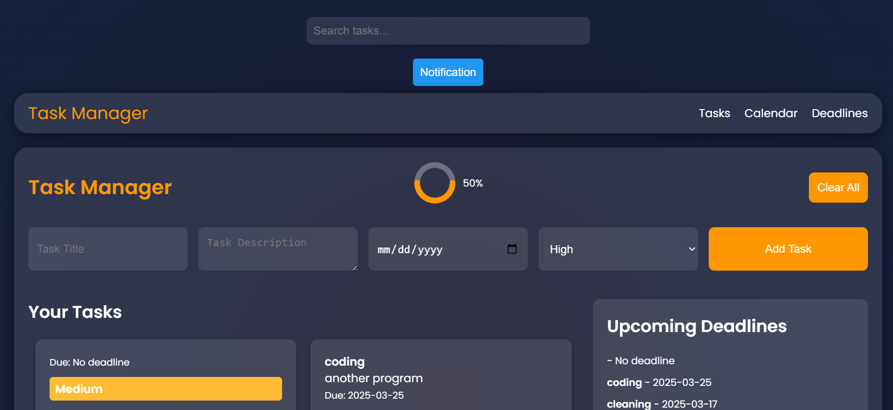

# TaskMasterPro

TaskMasterPro is a web-based task management application designed to help users organize and prioritize their tasks effectively. The application offers an intuitive interface for adding, editing, and categorizing tasks based on their urgency and importance.

---

## Objectives

### Problem Statement
Many individuals struggle with task management, leading to missed deadlines, stress, and inefficiency. TaskMasterPro addresses this by providing a simple yet powerful tool to organize tasks based on priority and deadlines.

### Goals
- **Task Management**: Allow users to add, edit, and delete tasks with ease.
- **Priority Categorization**: Organize tasks into High, Medium, and Low priority levels.
- **Deadline Tracking**: Highlight tasks with approaching deadlines to ensure timely completion.
- **User-Friendly Interface**: Provide an intuitive and visually appealing design for seamless task management.

---

## Features

- **Add Tasks**: Users can create new tasks by providing a description and selecting a priority level (High, Medium, Low).
- **Clear All Tasks**: Easily remove all tasks from the list with a single click.
- **Categorization**: Tasks are organized under categories such as High, Medium, and Low priority.
- **Upcoming Deadlines**: A dedicated section to display tasks with approaching deadlines.
- **Edit Tasks**: Users can modify task descriptions and priority levels as needed.
- **Delete Tasks**: Remove individual tasks from the list.
- **Search tasks**: users can serch up the tasks
- **navbar** - users can navigate easily throughtout the page
- **Responsive Design**: TaskMasterPro is optimized for use on various devices, including desktops,
laptops, tablets, and smartphones.

---

## Technologies Used

- **HTML5**: For structuring the web page.
- **CSS3**: For styling the application.
- **JavaScript**: For implementing interactive features and functionality.

---

## Coding Process

### Planning
- Defined the core features: task addition, priority categorization, and deadline tracking.
- Decided on a simple, user-friendly interface to ensure ease of use.

### Design
- Created wireframes for the layout, focusing on clarity and accessibility.
- Designed the UI to highlight priority levels and upcoming deadlines.

### Implementation
- Used JavaScript to handle task addition, deletion, and categorization.
- Implemented dynamic updates to the task list and deadline section.

### Testing
- Tested the application across multiple browsers (Chrome, Firefox, Edge) to ensure compatibility.
- Debugged issues related to task deletion and priority updates.

### Approach and Methodology
- Chose **HTML5**, **CSS3**, and **JavaScript** for their simplicity and compatibility with modern web browsers.
- Focused on a responsive design to ensure the application works well on both desktop and mobile devices.

---

## Key Challenges

### Challenges Encountered
- **Dynamic Task Updates**: Ensuring the task list updates dynamically without requiring a page reload.
- **Priority Categorization**: Implementing logic to sort tasks into High, Medium, and Low priority categories.

### Solutions and Problem-Solving
- Used JavaScript's DOM manipulation to dynamically update the task list.
- Implemented a sorting algorithm to categorize tasks based on priority.

---

## Features and Design

### Main Features
- **Task Addition**: Users can add tasks with a description and priority level.
- **Priority Categorization**: Tasks are automatically sorted into High, Medium, and Low priority categories.
- **Deadline Tracking**: Tasks with approaching deadlines are highlighted in a dedicated section.

### Design Choices
- **Minimalist Design**: Focused on simplicity and ease of use.
- **Color Coding**: Used colors to differentiate between priority levels (e.g., red for High, yellow for Medium, green for Low).

### Visual Aids


---

## Installation

To run TaskMasterPro locally:

1. **Clone the repository**:
   ```bash
   git clone https://github.com/azmi-adan/TaskMasterPro.git
   ```
2. **Navigate to the project directory**:
   ```bash
   cd TaskMasterPro
   ```
3. **Open `index.html` in your preferred web browser.**

---

## Usage

### Adding a Task
1. Enter the task description in the input field.
2. Select the priority level (High, Medium, Low).
3. Click the "Add Task" button.

### Viewing Tasks
- Tasks are displayed under their respective priority categories.
- The "Upcoming Deadlines" section highlights tasks nearing their due dates.

### Clearing Tasks
- Click the "Clear All" button to remove all tasks from the list.

---

## Live Demo

Check out the live demo of **TaskMasterPro**: [TaskMasterPro Live Demo](https://azmi-adan.github.io/TaskMasterPro/)

---

## Contributing

Contributions are welcome! To contribute:

1. Fork the repository.
2. Create a new branch:
   ```bash
   git checkout -b feature/YourFeatureName
   ```
3. Commit your changes:
   ```bash
   git commit -m 'Add some feature'
   ```
4. Push to the branch:
   ```bash
   git push origin feature/YourFeatureName
   ```
5. Open a pull request.

---

## License

This project is licensed under the **MIT License**. See the `LICENSE` file for details.

---

## Acknowledgments

- Inspired by various task management tools and applications.
- Special thanks to the open-source community for continuous support and contributions.

---


